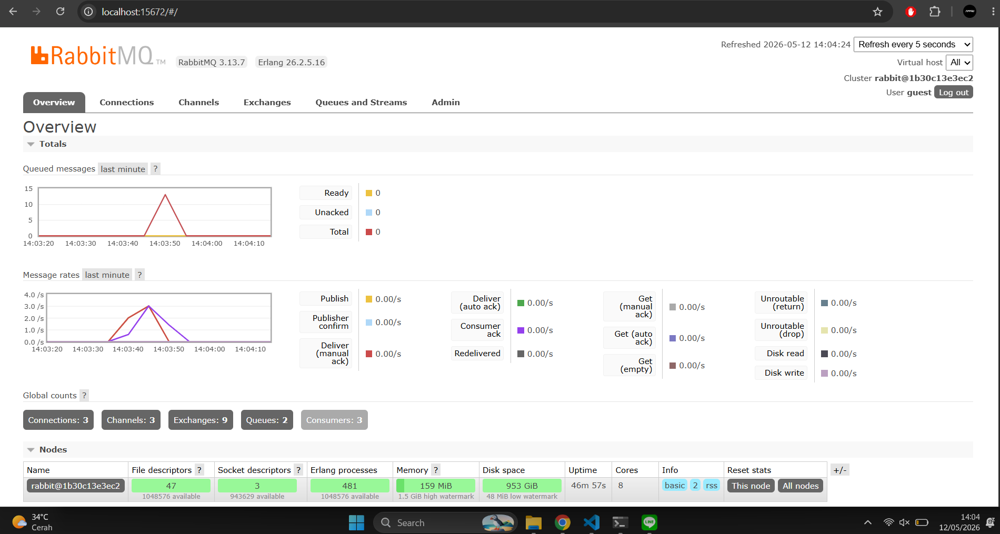

# a. What is amqp?  
AMQP (Advanced Message Queuing Protocol) adalah protokol standar terbuka untuk message-oriented middleware. Protokol ini mendefinisikan format pesan, mekanisme antrian, dan cara publisher/subscriber berkomunikasi lewat message broker seperti RabbitMQ.

#  What does it mean? guest:guest@localhost:5672 , what is the first guest, and what is the second guest, and what is localhost:5672 is for?  
guest pertama = username untuk login ke RabbitMQ
guest kedua = password untuk login ke RabbitMQ
localhost:5672 = alamat dan port tempat RabbitMQ berjalan (localhost = mesin sendiri, 5672 = port default AMQP)  

## Reflection and Running at least three subscribers

Saat menjalankan 3 subscriber secara bersamaan, spike pada grafik antrian RabbitMQ turun jauh lebih cepat dibandingkan saat hanya ada 1 subscriber. 
Hal ini terjadi karena ketiga subscriber memproses pesan secara paralel, pesan yang masuk ke antrian langsung dibagi dan diproses bersama-sama.

Ini adalah salah satu keunggulan utama event-driven architecture: kita bisa 
menambah jumlah subscriber kapan saja tanpa mengubah kode publisher sama sekali.

### Yang bisa diperbaiki dari kode publisher dan subscriber:

Pada kode publisher, semua event dikirim secara hardcode (Amir, Budi, Cica, 
Dira, Emir) dengan data yang statis. Seharusnya data ini bisa dibaca dari 
input pengguna atau dari database agar lebih dinamis.

Pada kode subscriber, tidak ada mekanisme logging atau error handling yang 
baik, jika terjadi error saat memproses pesan, program langsung berhenti 
tanpa mencatat apa yang salah. Sebaiknya ditambahkan error handling agar 
subscriber lebih robust.

